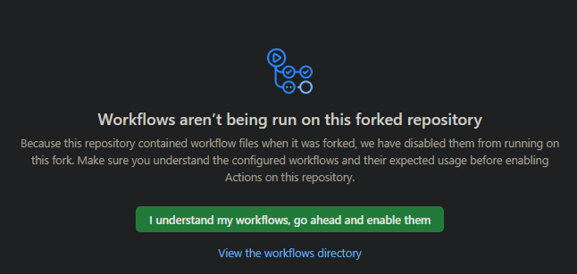
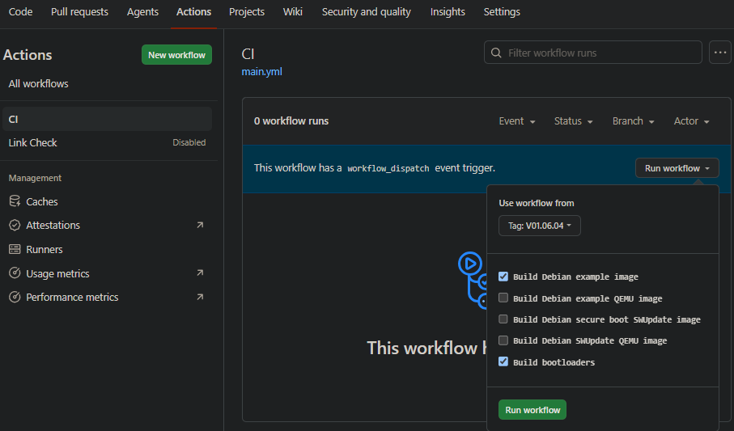
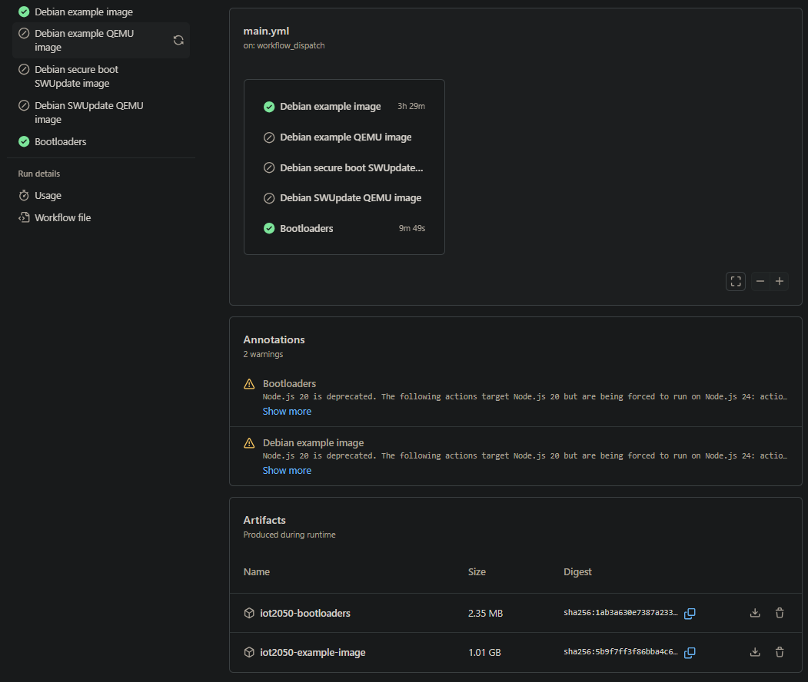

# No Docker Needed! Build the Siemens IoT2050 Example Image (Image.wic) from a V-tag with GitHub Actions

> Published: 2026-08
> Audience: Developers who want the compiled IoT2050 Debian example image (Image.wic) without setting up a local Docker build environment.

## Table of Contents

- [Why build with GitHub Actions?](#why-build-with-github-actions)
- [Step 1: Fork the official repo (key: fork everything)](#step-1-fork-the-official-repo-key-fork-everything)
- [Step 2: Enter the Actions page](#step-2-enter-the-actions-page)
- [Step 3: Select a V-tag and trigger the build](#step-3-select-a-v-tag-and-trigger-the-build)
- [Step 4: Wait for the build](#step-4-wait-for-the-build)
- [Step 5: Download the artifacts](#step-5-download-the-artifacts)
- [Step 6: Flash to an SD card](#step-6-flash-to-an-sd-card)
- [Important note: the EIO firmware](#important-note-the-eio-firmware)
- [Other tips](#other-tips)
- [FAQ](#faq)
- [Summary](#summary)

---

## Why build with GitHub Actions?

Building the IoT2050 Debian image (Isar framework, Yocto-like) traditionally requires:

- Installing Docker locally
- Downloading a lot of Debian packages
- Compiling the kernel and U-Boot — **1–2 hours for a first build**

The official repo `siemens/meta-iot2050` already has **GitHub Actions CI configured** — you only need to fork it and click a few buttons to get a compiled `Image.wic` in the cloud, without touching your local environment at all.

**Core idea**: Fork the official repo → manually trigger CI in Actions → select a V-tag version → download the artifact → flash it.

## Step 1: Fork the official repo (key: fork everything)

Open the official Siemens repo and fork it to your account:

- Official repo: https://github.com/siemens/meta-iot2050
- Your fork (example): `https://github.com/<your-account>/meta-iot2050`


**⚠️ Key step: do NOT check "Copy the master branch only"!**

| Option | Consequence |
| --- | --- |
| ❌ Unchecked (correct) | Branches + **all tags** are copied; you can select a V-tag later |
| ✅ Checked | Only the master branch is copied; **all tags are lost**, and no V-tag is selectable in Actions |

> If you already forked with it checked, the easiest fix: Settings → Delete this repository → fork again (full).

## Step 2: Enter the Actions page

Go to your fork → click the **Actions** tab at the top.

- Click **CI** in the workflow list on the left (the only build workflow)
- "Run workflow" (the manual trigger button) appears on the right
- **First use**: click "I understand my workflows, go ahead and enable them" to enable workflows



## Step 3: Select a V-tag and trigger the build

Click **Run workflow**; in the panel:

1. **"Use workflow from"** dropdown → select **Tag: V01.06.04** (currently the latest release, published 2026-06-17)
   - If this tag isn't in the list, you checked "Copy the master branch only" when forking — fork again
2. Build items (check as needed):

| Build item | Artifact | Needed? |
| --- | --- | --- |
| **build_debian_example_image** | `iot2050-image-example-iot2050-debian-iot2050.wic` + `.bmap` | ✅ Yes (example image) |
| build_debian_example_qemu_image | QEMU virtual image | ❌ Usually not |
| build_debian_swupdate_image | Secure-boot SWUpdate image | ❌ Secure-boot scenarios only |
| build_debian_swupdate_qemu_image | SWUpdate QEMU | ❌ |
| **build_bootloaders** | `*.bin` (U-Boot/SEBoot/EDK2 etc.) | ✅ Yes (boot firmware) |

> A typical selection: `build_debian_example_image` + `build_bootloaders` (you can build only the example image first to validate the pipeline).



3. Click **Run workflow** to start.

## Step 4: Wait for the build

- Build time: **~1–2 hours for the first build** (downloads many Debian packages, compiles kernel/U-Boot)
- Click the running job (green/yellow dot) to watch logs live
- Note: the official CI's "Free Disk Space" step clears disk space on each job — normal

## Step 5: Download the artifacts

After the build finishes:

1. Go back to that workflow run's **Summary** page
2. In the **Artifacts** area at the bottom:



```
iot2050-example-image/          ← example image
  ├── iot2050-image-example-iot2050-debian-iot2050.wic
  └── iot2050-image-example-iot2050-debian-iot2050.wic.bmap

iot2050-bootloaders/            ← boot firmware
  └── *.bin
```

3. Click to download the zip; extract the `.wic` file.

> ⚠️ Artifacts have a **90-day retention period** — download them in time.

## Step 6: Flash to an SD card

```bash
# Method 1: dd (Linux)
sudo dd if=iot2050-image-example-iot2050-debian-iot2050.wic of=/dev/mmcblk0 bs=4M oflag=sync

# Method 2: bmaptool (faster and safer, recommended)
sudo bmaptool copy iot2050-image-example-iot2050-debian-iot2050.wic /dev/mmcblk0

# On Windows, use Rufus / balenaEtcher to flash the .wic
```

## Important note: the EIO firmware

**Only the IoT2050 SM model needs real EIO firmware.**

In the official CI, jobs such as `debian-swupdate-image` mock the EIO firmware with **empty files**:

```bash
touch ./meta-sm/recipes-app/iot2050-eiofsd/files/bin/iot2050-eiofsd
touch ./meta-sm/recipes-app/iot2050-eiofsd/files/bin/map3-fw.bin
touch ./meta-sm/recipes-app/iot2050-eiofsd/files/bin/firmware-version
```

- **When real EIO binaries are needed**: **only when the example image is used on the IoT2050 SM model** (the SM's expansion IO subsystem depends on the EIO firmware)
- **Non-SM models** (e.g. IoT2050 Basic / Advance / M.2): EIO is irrelevant — use the CI artifacts directly
- **IoT2050 SM model**: you must download the EIO firmware from Siemens yourself, modify the workflow to inject it, and rebuild:
  - Download: https://support.industry.siemens.com/cs/document/109741799/downloads-for-simatic-iot20x0
  - Extract into `meta-sm/recipes-app/iot2050-eiofsd/files/bin/`, and add a download step to the workflow before rebuilding

## Other tips

**Syncing upstream after forking** (the "Sync fork" button doesn't sync tags — use git):

```bash
git clone https://github.com/<your-account>/meta-iot2050.git
cd meta-iot2050
git remote add upstream https://github.com/siemens/meta-iot2050.git
git fetch upstream --tags        # fetch all upstream tags
git push origin --tags           # push them to your fork
```

**Want to build with the latest master**: when running the workflow, pick **Branch: master** in "Use workflow from"; everything else is the same.

## FAQ

| Symptom | Cause | Fix |
| --- | --- | --- |
| No V-tag in "Use workflow from" | Forked with "Copy master only" checked | Fork again (unchecked) or `git push origin --tags` |
| Build fails: not enough disk space | ubuntu-latest disk pressure | The official free-disk-space step is built in; just retry |
| Downloading artifacts times out | Image is large (~1–2GB) | Download directly in the browser; don't use multi-threaded download tools |
| Want EIO features but the image lacks them | CI mocks the firmware with stubs (only the SM model needs real firmware) | Inject the real firmware yourself |
| Want to change the image content (packages/config) | — | Modify the corresponding recipe on your fork, then trigger the build manually |

## Summary

1. **Fork everything** (don't check "Copy master only"), or you won't get the V-tags
2. **Trigger Actions manually** with a tag; the cloud builds it — no local Docker needed
3. Artifacts are downloaded from **Artifacts**, valid for 90 days
4. The **IoT2050 SM model** needs you to inject the real EIO firmware

---

> ⚠️ **Disclaimer**: This article is a personal technical write-up for reference only; it does not represent any vendor's official position. For industrial environments, have qualified personnel evaluate and perform the operations at your own risk.
