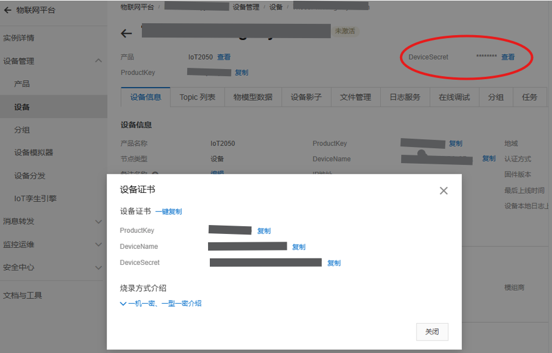
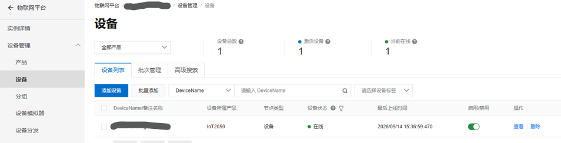

# Connecting a SIMATIC IoT2050 to Alibaba Cloud IoT Platform: 15 Lines of Stdlib HMAC, MQTT Uplink in 30 Minutes

> **Applies to**: developers who need to push industrial edge-gateway data to a managed cloud MQTT endpoint — and who would rather not install a vendor SDK to do it.
> **Hardware / base version**: SIMATIC IOT2050 (TI AM65x, ARM64), [Example Image V01.06.04](https://github.com/siemens/meta-iot2050) (Debian 13 trixie + kernel 6.12).
> **Platform**: Alibaba Cloud IoT Platform (Aliyun IoT), new-generation public instance — **free tier**: 50 devices online / 500 creatable / 5 TPS upstream+downstream / 10 OTA jobs per month.
> **What you'll get**: a working uplink in four steps — console setup, the per-device HMAC-SHA256 signature, a 30-line verification script, and a systemd service for autostart and reconnect.

> 🖼️ **About the screenshots**: images live in the `img/` folder next to this file — refer to them by the file name in each image reference.

## Table of Contents

- [1. Background](#1-background)
- [2. Prerequisites](#2-prerequisites)
- [3. Step 1: Cloud-Side Setup](#3-step-1-cloud-side-setup)
- [4. Step 2: MQTT Authentication](#4-step-2-mqtt-authentication)
- [5. Step 3: Minimal Verification Script](#5-step-3-minimal-verification-script)
- [6. Step 4: Run It as a systemd Service](#6-step-4-run-it-as-a-systemd-service)
- [7. Troubleshooting Cheat Sheet](#7-troubleshooting-cheat-sheet)
- [8. Summary and Next Steps](#8-summary-and-next-steps)
- [References](#references)
- [Disclaimer](#disclaimer)

---

## 1. Background

When you put an industrial gateway's data "in the cloud", there are two common choices: run your own Mosquitto broker on a plain ECS instance, or use a managed IoT platform. This article takes the second route — the **new-generation public instance of Alibaba Cloud IoT Platform** — for fairly practical reasons:

| | Self-hosted Mosquitto on ECS | Alibaba Cloud IoT Platform (public instance) |
|---|---|---|
| Cost | from ~¥99/year | **Free** (50 devices online / 500 creatable / 5 TPS / 10 OTA/month) |
| Authentication | You configure usernames and passwords | Per-device triple (ProductKey / DeviceName / DeviceSecret) + HMAC signature |
| Operations | Patching, hardening, certificate renewal — all yours | Fully managed |
| Trade-off | — | Connection parameters must be signed to spec, and topics must follow the platform's categories |

Most Alibaba Cloud tutorials out there use an ESP32 or a Raspberry Pi. Complete, documented edge-gateway integration is rare, so this article walks the whole path on an IoT2050: **the signature algorithm, a minimal verification script, and systemd service-isation**.

One design constraint runs through everything: **the signature uses nothing but the Python standard library (`hashlib` / `hmac`) — no Alibaba Cloud SDK is installed.** The vendor SDKs are pip-only and not small, while a per-device signature is fundamentally just one HMAC-SHA256 call. That's 15 lines.

---

## 2. Prerequisites

| Item | Requirement |
|---|---|
| Device | SIMATIC IOT2050 (ARM64), Debian-based (tested on Example Image V01.06.04 / trixie / kernel 6.12) |
| Network | **Outbound** access from the gateway to the public internet on TCP 1883, and DNS resolution |
| Account | Alibaba Cloud account with real-name verification completed |
| Runtime | Python 3.7+; `paho-mqtt` is the **only** third-party package |
| Time | Console work ~12 minutes, script verification ~5 minutes |

`paho-mqtt` can come from either source:

```bash
apt install python3-paho-mqtt          # 2.1.0 in Debian 13 — same API generation as pip's
# or, inside a virtualenv:
pip install paho-mqtt
```

> ⚠️ **If you use a virtualenv, install into that venv.** `apt install python3-paho-mqtt` lands in the *system* Python's `site-packages`, which an isolated venv does not see. Confirm with `/path/to/venv/bin/python -c "import paho.mqtt; print(paho.mqtt.__version__)"` before you start debugging anything else.

---

## 3. Step 1: Cloud-Side Setup

### 3.1 Enable the platform and note your instance ID

Alibaba Cloud console → search for **IoT Platform** (物联网平台) → enable. A new account defaults to the **new-generation public instance**. On the instance overview page, note the **Instance ID** (it looks like `iot-06z00djgad7bo5r`) — the endpoint and the signature both need it.

### 3.2 Find the MQTT endpoint

Instance details → View development configuration → MQTT tab:

```
New-generation public instance / Enterprise instance:
    {InstanceId}.mqtt.iothub.aliyuncs.com:1883

Legacy public instance (do NOT use):
    {productKey}.iot-as-mqtt.{regionId}.aliyuncs.com:1883
```

⚠️ **If a tutorial shows an `iot-as-mqtt` hostname, it was written for the legacy public instance** — the two formats are not interchangeable.

### 3.3 Create a product and define the thing model

Device Management → Product → Create Product:

- Node type: **Direct device** (the gateway registers as a single device)
- Data format: **ICA standard data format (Alink JSON)** — this gives you the thing-model pipeline and console visualisation. "Passthrough/custom" requires you to write a parsing script on the platform side; not recommended here.

Product details → Feature definition → Add custom feature. Example: identifier `tick`, type `int32` (mirroring a PLC's free-running counter).

> The identifier is the key inside the uplink JSON's `params` object. It is **case-sensitive** — decide it before you publish, not after.

### 3.4 Create the device and capture the triple

Device Management → Add Device, then record the triple:

```
ProductKey:   a1XXXXXXXX
DeviceName:   my-gateway-01
DeviceSecret: xxxxxxxx        ← shown once — store it safely
```

After creation, click **View** next to the device name to open the **Device Certificate** dialog, where all three values can be copied in one click. `DeviceSecret` is only visible here — once you close it, it's gone:



---

## 4. Step 2: MQTT Authentication

### 4.1 Platform rules

The CONNECT packet carries three parameters:

| Parameter | Rule |
|---|---|
| `mqttClientId` | `{clientId}\|securemode=3,signmethod=hmacsha256\|` for plain TCP; use `securemode=2` for TLS |
| `username` | `{deviceName}&{productKey}` |
| `password` | Hex digest of `hmac_sha256(deviceSecret, content)` |

**The content string** is built by sorting the parameters (`clientId`, `deviceName`, `productKey`, optionally `timestamp`) by **parameter-name alphabetically**, then concatenating `name + value` pairs:

```
clientId{clientId}deviceName{deviceName}productKey{productKey}
```

Two details that bite people:

1. **`timestamp` is optional.** The official documentation states it "may be omitted" — and when it is, the `timestamp` segment is absent from the content string too. **Omitting it is recommended**: the signature then does not depend on the device clock, which removes an entire failure class. Clock drift on industrial hardware is routine; keep it out of your auth path.
2. **Keep Alive must be between 30 and 1200 seconds.** Outside that range the platform rejects the connection outright. 300 is a good default.

### 4.2 The implementation — standard library only

```python
import hashlib
import hmac

def mqtt_auth(product_key, device_name, device_secret, client_id):
    """Return (mqttClientId, username, password) for securemode=3 (plain TCP)."""
    content = f"clientId{client_id}deviceName{device_name}productKey{product_key}"
    sign = hmac.new(device_secret.encode(), content.encode(),
                    hashlib.sha256).hexdigest()
    mqtt_client_id = f"{client_id}|securemode=3,signmethod=hmacsha256|"
    username = f"{device_name}&{product_key}"
    return mqtt_client_id, username, sign
```

### 4.3 The fastest debugging tool: cross-check against the console

Device details → Device information → **MQTT connection parameters → View**. The platform computes the same four values with the same algorithm and lets you copy them.

**When your script won't connect, compare against these values field by field** — it tells you within seconds whether the signature or the hostname is wrong. This is the single highest-leverage step in the whole debugging process; it beats reading any log.

---

## 5. Step 3: Minimal Verification Script

Don't touch your production collector yet. Verify "connect + publish + receive reply" with a standalone script first:

```python
import hashlib, hmac, json, sys, time
import paho.mqtt.client as mqtt

# ===== replace with your own triple and instance ID =====
PRODUCT_KEY   = "a1XXXXXXXX"
DEVICE_NAME   = "my-gateway-01"
DEVICE_SECRET = "xxxxxxxx"
INSTANCE_ID   = "iot-06z00djgad7bo5r"
CLIENT_ID     = "my-gateway-01"       # your choice; MAC or serial number works well

HOST = f"{INSTANCE_ID}.mqtt.iothub.aliyuncs.com"
PORT = 1883
TOPIC_POST  = f"/sys/{PRODUCT_KEY}/{DEVICE_NAME}/thing/event/property/post"
TOPIC_REPLY = f"/sys/{PRODUCT_KEY}/{DEVICE_NAME}/thing/event/property/post_reply"


def mqtt_auth(pk, dn, ds, cid):
    content = f"clientId{cid}deviceName{dn}productKey{pk}"
    sign = hmac.new(ds.encode(), content.encode(), hashlib.sha256).hexdigest()
    return f"{cid}|securemode=3,signmethod=hmacsha256|", f"{dn}&{pk}", sign


def on_connect(client, userdata, flags, rc, properties=None):
    print("connected rc =", rc)
    client.subscribe(TOPIC_REPLY)


def on_message(client, userdata, msg):
    print("reply:", msg.topic, msg.payload.decode())


def main():
    cid, user, pwd = mqtt_auth(PRODUCT_KEY, DEVICE_NAME, DEVICE_SECRET, CLIENT_ID)
    # paho >= 2.0 requires an explicit callback API version
    client = mqtt.Client(mqtt.CallbackAPIVersion.VERSION1, client_id=cid)
    client.username_pw_set(user, pwd)
    client.on_connect = on_connect
    client.on_message = on_message
    client.connect(HOST, PORT, keepalive=300)
    client.loop_start()

    while True:
        payload = {
            "id": str(int(time.time())),
            "version": "1.0",
            "sys": {"ack": 0},
            "params": {"tick": int(time.time()) % 1000},
            "method": "thing.event.property.post",
        }
        client.publish(TOPIC_POST, json.dumps(payload), qos=1)
        print("published:", payload["id"])
        time.sleep(10)


if __name__ == "__main__":
    try:
        main()
    except KeyboardInterrupt:
        sys.exit(0)
```

Expected output:

```
connected rc = 0
reply: /sys/.../thing/event/property/post_reply {"code":200,...}
```

Then confirm three things in the console: the device **status is Online**, the thing-model data page shows `tick` rolling every 10 seconds, and the log service reports `property/post` returning 200. Here is the device list from an actual run:



**Three notes on the payload**: `params` accepts the shorthand form (`{"tick": 123}` — a bare value); the value type must match the thing-model definition (sending a float for an `int32` errors out); and the free instance caps you at 5 messages/second, which is ample for 1 Hz industrial sampling — for high-rate raw data, batch it or route it through a local broker.

---

## 6. Step 4: Run It as a systemd Service

Once the script works, don't leave it hanging in an SSH session. A service gives you autostart on boot, restart on crash, and automatic reconnect after a network drop.

### 6.1 Make shutdown clean first

systemd stops a service with **SIGTERM**. paho's `loop_start()` background thread is not carried away by it, so you need an explicit teardown. Append this inside `main()`, right after `loop_start()`:

```python
import signal, atexit

def _shutdown(client):
    client.loop_stop()
    client.disconnect()

atexit.register(_shutdown, client)
signal.signal(signal.SIGTERM, lambda *_: sys.exit(0))
```

Skip this and `systemctl stop` reports success while the process lingers — and the next start fails.

### 6.2 Move the triple out of the script

A triple hard-coded in a script is a secret in plaintext on disk. Put it in an environment file instead:

```bash
install -m 600 /dev/null /etc/aliyun-iot.env
cat >> /etc/aliyun-iot.env <<'EOF'
PRODUCT_KEY=a1XXXXXXXX
DEVICE_NAME=my-gateway-01
DEVICE_SECRET=xxxxxxxx
INSTANCE_ID=iot-06z00djgad7bo5r
EOF
```

Read them in the script with `os.environ.get("PRODUCT_KEY", "")` and friends.

### 6.3 The unit file

`/etc/systemd/system/aliyun-iot.service` — adjust the paths to your own venv and script:

```ini
[Unit]
Description=Aliyun IoT Platform MQTT uploader
Wants=network-online.target
After=network-online.target

[Service]
Type=simple
EnvironmentFile=/etc/aliyun-iot.env
ExecStart=/opt/myapp/venv/bin/python /opt/myapp/aliyun_iot_test.py
Restart=always
RestartSec=10

[Install]
WantedBy=multi-user.target
```

```bash
systemctl daemon-reload
systemctl enable --now aliyun-iot.service
journalctl -u aliyun-iot.service -f      # expect "connected rc = 0" plus periodic replies
```

Four things to verify: the device shows Online within a minute of a reboot; `kill -9` on the process brings it back within 10 seconds; pulling the Ethernet cable and reinserting it reconnects automatically; and `systemctl stop` leaves nothing behind (`pgrep` comes back empty).

> `Restart=always` is not a cure-all. If the triple becomes invalid (device deleted, secret rotated), the service drops into a rejection loop, retrying every 10 seconds and flooding the journal. Most connection faults are self-healing network blips, which is why `always` is the default here — if that trade-off bothers you, switch to `on-failure` and add `StartLimitBurst` / `StartLimitIntervalSec` to cap the retries.

---

## 7. Troubleshooting Cheat Sheet

| Symptom | Root cause | Fix |
|---|---|---|
| `rc != 0`, connection refused | Bad signature — content string not in alphabetical order, or the triple is mistyped. This accounts for ~90% of cases | Compare field by field against the console's "MQTT connection parameters" |
| `rc != 0` | Keep Alive outside 30–1200 s | Set it to 300 |
| `rc != 0` | Endpoint uses the `iot-as-mqtt` (legacy) format | Use `{InstanceId}.mqtt.iothub.aliyuncs.com` |
| Connects but no reply | Topic permission not configured, or the identifier doesn't match the thing model | Check the topic category list and the feature definition |
| Reply `code: 6204` | Alink JSON field or type mismatch | Match the value type to the thing model |
| paho raises `TypeError` | Callback API changed in paho >= 2.0 | Pass `CallbackAPIVersion.VERSION1` |
| Everything suddenly refused | Free-instance 5 TPS limit exceeded | Lower the rate or use the batch API |

**Security note**: port 1883 is plaintext TCP. The signature protects the credential path only — the payload itself is in the clear. **For production, switch to 8883 with `securemode=2`**: the signature rules are unchanged, you simply change the port and mode and load the Alibaba Cloud root certificate. And never commit a triple to git.

---

## 8. Summary and Next Steps

The whole chain really comes down to three pieces: **one HMAC signature function, one minimal verification script, one systemd unit.** The console work is just filling in forms. Swap the verification script for your own collector, replace `params` with your thing-model properties, and you have a working industrial data path to the cloud.

Worth extending later:

- **Custom topics** (`/{pk}/{dn}/user/xxx`) — free-form payloads, better suited to high-volume raw data
- **LWT (last will and testament)** — lets you distinguish "the device died" from "the cloud link dropped"
- **Rules engine** — forward the stream onward to a time-series database or function compute

---

## References

- [Device developer guide — MQTT direct connection](https://help.aliyun.com/document_detail/2860280.html)
- [View and configure instance endpoints](https://www.alibabacloud.com/help/zh/iot/user-guide/manage-the-endpoint-of-an-instance)
- [IoT Platform billing overview — public instance free specification](https://helpcdn.aliyun.com/document_detail/124250.htm)
- [Report device properties (Alink JSON)](https://help.aliyun.com/document_detail/2860326.html)
- [Compute MQTT signature parameters (console cross-check)](https://help.aliyun.com/en/iot/user-guide/how-do-i-obtain-mqtt-parameters-for-authentication)
- [SIMATIC IOT2050 meta-iot2050 (GitHub)](https://github.com/siemens/meta-iot2050)

## Disclaimer

This is a personal record of a hands-on exercise. The environment was a SIMATIC IOT2050 running a specific firmware/image version, and the console described reflects the Alibaba Cloud IoT Platform UI as of September 2026. Console entry points, free-tier specifications, and endpoint formats may change as the platform evolves — always defer to the official documentation.
