# Turn Your IoT2050 into a SoftPLC: Installing CODESYS Control for Linux ARM64 SL (RT Image Build → One-Click Deploy → Program Running)

> Applies to: developers who want to run IEC 61131-3 soft-PLC logic on a Siemens SIMATIC IoT2050 (TI AM65x, ARM64).
> Base version: V1.6.4 RT image (Debian 13 trixie + kernel 6.12.46-cip8 RT), built from the `V01.06.04` tag of `siemens/meta-iot2050` with GitHub Actions.
> What you'll get: a full walk-through from building a real-time (PREEMPT_RT) image, to deploying the CODESYS runtime with the official Deploy tool, to downloading and running your first ST program.

> 🖼️ **About the screenshots**: all images (GitHub build flow, CODESYS dialogs) live in the `img/` folder next to this file — refer to them by the file name in each image reference.

## Table of Contents

- [1. Background](#1-background)
- [2. Prerequisites](#2-prerequisites)
- [3. Components you need](#3-components-you-need)
- [4. Step 1: Build a V1.6.4 RT image with GitHub Actions](#4-step-1-build-a-v164-rt-image-with-github-actions)
- [5. Step 2: Install the CODESYS Installer](#5-step-2-install-the-codesys-installer)
- [6. Step 3: Install CODESYS V3.5 SP22 + the ARM64 SL runtime](#6-step-3-install-codesys-v35-sp22--the-arm64-sl-runtime)
- [7. Step 4: Deploy the runtime to the IoT2050](#7-step-4-deploy-the-runtime-to-the-iot2050)
- [8. Step 5: Verify the installation](#8-step-5-verify-the-installation)
- [9. Step 6: Download and run a simple program](#9-step-6-download-and-run-a-simple-program)
- [10. Licensing (removing the 2-hour limit)](#10-licensing-removing-the-2-hour-limit)
- [11. Common pitfalls at a glance](#11-common-pitfalls-at-a-glance)
- [12. Summary](#12-summary)
- [References](#references)

---

## 1. Background

The IoT2050 uses a TI AM65x (AM6528/AM6548, 4× Cortex-A53) processor — ARM64 architecture, Debian-based out of the box. CODESYS provides an official soft-PLC runtime for Linux ARM64, so after installation the IoT2050 can act as both:

- **A soft PLC** (CODESYS runtime executing IEC 61131-3 programs)
- **An edge gateway / data collector** (Node-RED, MQTT, OPC UA and other existing services)

> ⚠️ Note: CODESYS is commercial software. **Without a license the runtime stops every 2 hours** (trial limit); for production use you must buy a single-device license (see §10).

---

## 2. Prerequisites

| Item | Requirement |
|---|---|
| Device | IoT2050 (ARM64), running the **V1.6.4 RT image** (Debian 13 trixie + kernel 6.12.46-cip8 RT) |
| Network | IoT2050 reachable from the Windows PC (same LAN is enough) |
| Account | `root` (or any user with sudo) |
| PC | Windows + CODESYS Installer + CODESYS Development System V3.5 SP22 |
| Disk | Runtime needs only tens of MB; eMMC/SD space is plenty |

> **Why the RT (real-time) kernel matters?** The soft PLC's cyclic tasks (e.g. a 1 ms scan) depend on the kernel's real-time scheduling. CODESYS requires a PREEMPT_RT kernel to guarantee deterministic cycle times. On a stock kernel it installs and runs, but jitter is uncontrolled — **not acceptable for actual control**.

---

## 3. Components you need

| Component | Purpose | Size | Where to get it |
|---|---|---|---|
| CODESYS Installer | Manage installation of the IDE / components / .package files | ~tens of MB | CODESYS website |
| CODESYS Development System V3.5 SP22 | Programming / debugging IDE | **~1.3–2.0 GB** | CODESYS website |
| CODESYS Control for Linux ARM64 SL (.package) | The runtime installer | **~48 MB** | CODESYS Store |
| CODESYS Control SL Deploy Tool | Provides the `Tools → Deploy Control SL` menu | Bundled with Installer | CODESYS Installer |
| License | Removes the 2-hour trial limit | Activated online | CODESYS Store (single-device application license) |

> The Deploy tool pushes the runtime **and its dependencies** to the IoT2050 and installs them automatically — you do **not** need to install any prerequisite component manually. Seeing only one "Install" step in the UI is normal.

Current versions: IDE **3.5.22.20** (SP22), ARM64 SL **4.21.0.0** (released 2026-06).

---

## 4. Step 1: Build a V1.6.4 RT image with GitHub Actions

### 4.1 Fork the upstream repo and create a branch from the V1.6.4 tag

**① Fork the upstream repo** (one-time, in the browser):
Open https://github.com/siemens/meta-iot2050 → click **Fork** in the top right → pick your account (by default all branches **and tags** are copied):

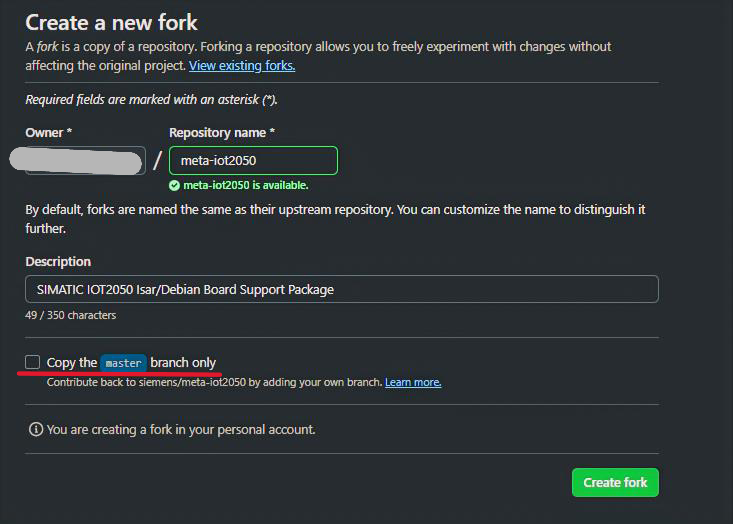

> If you checked "Copy the master branch only" when forking, the tags are **not** copied — pull them later in step ③ with `git fetch upstream --tags` (the GitHub "Sync fork" button syncs branch code only, **not tags**).

**② Clone your fork locally and add the upstream remote** (one-time):

```bash
git clone https://github.com/<your-account>/meta-iot2050.git
cd meta-iot2050
git remote add upstream https://github.com/siemens/meta-iot2050.git
git fetch upstream --tags              # fetch all upstream tags
```

**③ Create a branch from the `V01.06.04` tag and push it**:

```bash
git checkout -b codesys-rt V01.06.04   # create a branch from the tag (tags are read-only snapshots; the web UI cannot create a branch from a tag)
git push origin codesys-rt             # push the branch to your fork
```

### 4.2 Modify the workflow: add the RT fragment to the example job

In the official V01.06.04 `.github/workflows/main.yml`, the `debian-example-image` job's build command is **RT-free by default** (it produces a normal example image):

```yaml
# Official default (normal example image, no RT)
run: ./kas-container build kas-iot2050-example.yml:kas/opt/package-lock.yml
```

To build the RT variant, change that job's build command to chain in `kas/opt/preempt-rt.yml` (order per the official `debian-swupdate-image` job — `preempt-rt.yml` comes **before** `package-lock.yml`):

```yaml
# Modified (RT kernel)
run: ./kas-container build kas-iot2050-example.yml:kas/opt/preempt-rt.yml:kas/opt/package-lock.yml
```

Content of `kas/opt/preempt-rt.yml` (already shipped in the V01.06.04 repo — nothing to create):

```yaml
local_conf_header:
  preempt-rt: |
    KERNEL_NAME = "iot2050-rt"
```

> How to edit: on your fork's web page open `.github/workflows/main.yml` → pencil icon → find the build step under the `debian-example-image:` job → replace the `run:` line → commit to the `codesys-rt` branch (or commit locally and push).
>
> Adding this fragment switches the kernel to RT (`KERNEL_NAME = "iot2050-rt"`).

### 4.3 Trigger the build and download the image

1. Enable workflows (a fork does not run them by default; enable them once):

   

2. **Actions** → **CI** workflow on the left → **Run workflow** button → **Branch** dropdown: `codesys-rt` → check `build_debian_example_image` (uncheck the QEMU / SWUpdate / bootloaders items to save build time) → **Run workflow**:

   

   > V01.06.04's workflow has built-in `workflow_dispatch` with inputs; `build_debian_example_image` defaults to true.

3. When the build finishes (~1–2 hours), download the `iot2050-example-image` artifact (zip) at the bottom of the run page, then extract:

   ```
   iot2050-image-example-iot2050-debian-iot2050.wic      (~1 GB, the system image)
   iot2050-image-example-iot2050-debian-iot2050.wic.bmap (flash verification file)
   ```

   

   > ⚠️ The official workflow **hard-codes the artifact file name as `iot2050-image-example-iot2050-debian-iot2050.wic` — there is no `-RT` suffix**, whether or not you added the RT fragment. The only reliable way to tell an RT image is `uname -r` after flashing (see §4.5). Don't judge by the file name.

### 4.4 Flash the image to the IoT2050

```bash
# Linux (bmaptool recommended)
sudo bmaptool copy iot2050-image-example-iot2050-debian-iot2050.wic /dev/mmcblk0

# or dd
sudo dd if=iot2050-image-example-iot2050-debian-iot2050.wic of=/dev/mmcblk0 bs=4M oflag=sync

# On Windows, use Rufus / balenaEtcher to flash the .wic
```

### 4.5 Update the IoT2050 firmware to V1.6.4

Download the firmware update package from SIOS (`V1.6.4-iot2050-firmware-update-upd.zip`), extract it and upgrade with the `fw_update` tool:

```bash
sudo fw_update -i <firmware-file>
```

> Follow the exact command in the firmware package's instructions. After upgrade, reboot and verify:
> ```bash
> uname -r            # expect 6.12.46-cip8-rt (with the rt suffix)
> cat /etc/os-release # expect trixie (Debian 13)
> ```

---

## 5. Step 2: Install the CODESYS Installer

1. Download **CODESYS Installer** from the CODESYS website.
2. Run the installer.
3. You will use CODESYS Installer afterwards to install the IDE, components and .package files.

---

## 6. Step 3: Install CODESYS V3.5 SP22 + the ARM64 SL runtime

Install these in order with CODESYS Installer:

| Order | Component | Notes |
|---|---|---|
| ① | **CODESYS Development System V3.5 SP22** | The IDE (~1.3–2 GB) |
| ② | **CODESYS Control for Linux ARM64 SL** | Runtime .package (~48 MB) |
| ③ | **CODESYS Control SL Deploy Tool** | Provides the `Tools → Deploy Control SL` menu |

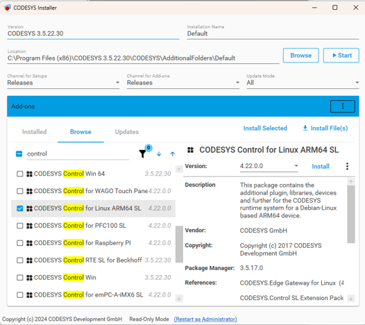

> ⚠️ **Key point: Deploy Control SL is a separate add-on.** Without it there is no `Tools → Deploy Control SL` menu entry — this is the most common "I can't find it" cause.

---

## 7. Step 4: Deploy the runtime to the IoT2050

1. IDE menu **Tools → Deploy Control SL**:

   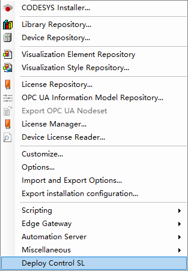

2. In the **Communication** tab enter the IoT2050's IP / username / password and connect:

   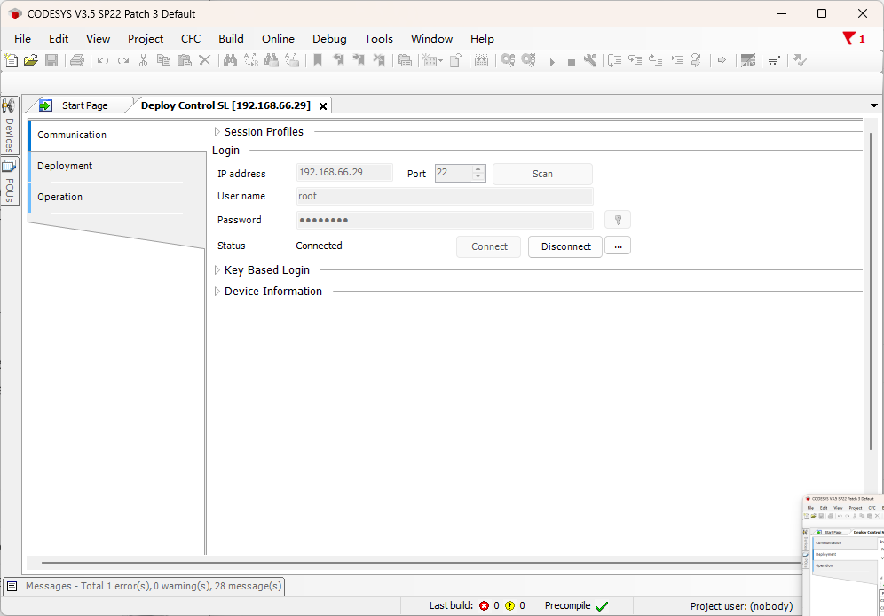

   - IP: `<IoT2050-IP>` (your device's actual IP)
   - User: `root` (factory default)

3. In the **Deploy** tab select **CODESYS Control for Linux ARM64 SL** and its version → **Install**:

   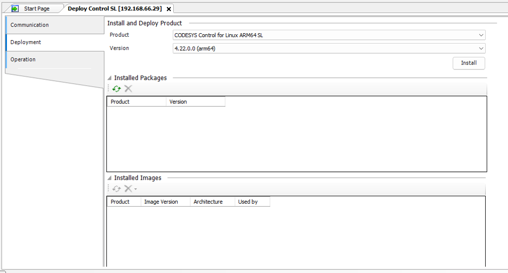

4. It asks whether to install the Edge Gateway as well — click **Yes**:

   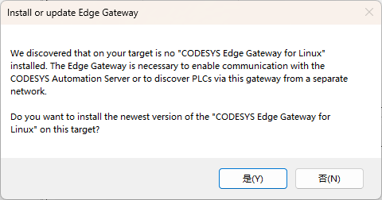

5. Installation succeeds and the runtime starts automatically:

   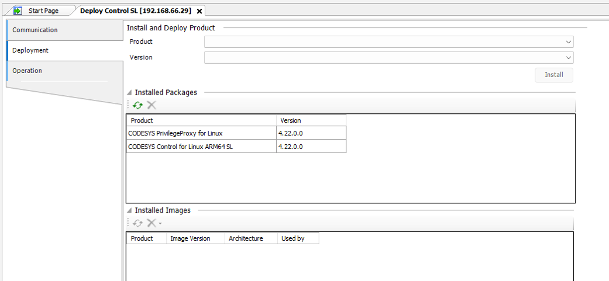

   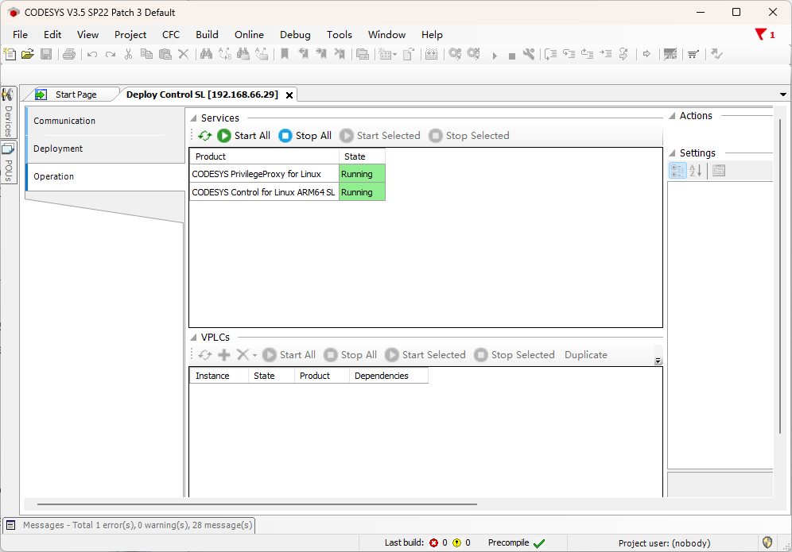

> **Fallback path**: if the Deploy tool is not available, SSH to the IoT2050 and install manually:
>
> ```bash
> # Copy the runtime deb to the device (the deb is in the Delivery folder unpacked from the .package)
> scp codesyscontrol_linuxarm64_*_arm64.deb root@<IoT2050-IP>:/root/
>
> # Install on the IoT2050 (use fix-broken to resolve dependencies automatically)
> dpkg -i codesyscontrol_linuxarm64_*_arm64.deb
> apt --fix-broken install
> systemctl status codesyscontrol            # expect active (running)
> ```

---

## 8. Step 5: Verify the installation

```bash
# Service status (expect active (running))
systemctl status codesyscontrol

# Runtime log
journalctl -u codesyscontrol

# Confirm the architecture
uname -m          # aarch64
```

---

## 9. Step 6: Download and run a simple program

### 9.1 Create a new project

1. IDE menu **File → New Project** → choose **Standard project**:

   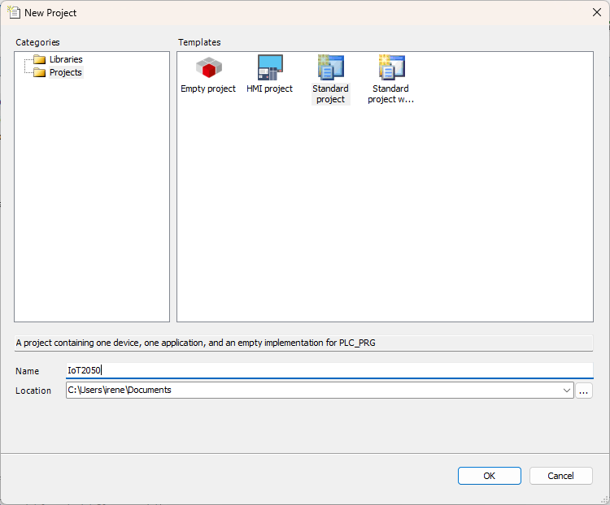

2. In the **Standard Project** dialog choose **Device = CODESYS Control for Linux ARM64 SL** and **PLC_PRG in = Structured Text (ST)** → OK:

   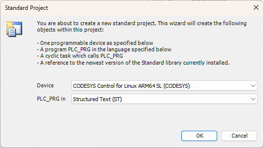

3. Right-click **Device** in the device tree → **Scan for devices** (auto-discovers the IoT2050).
4. On first connection it prompts **Add Device User** — create a CODESYS runtime user (mind the password policy: ≥8 characters including upper/lower case, digits and special characters; too simple is rejected):

   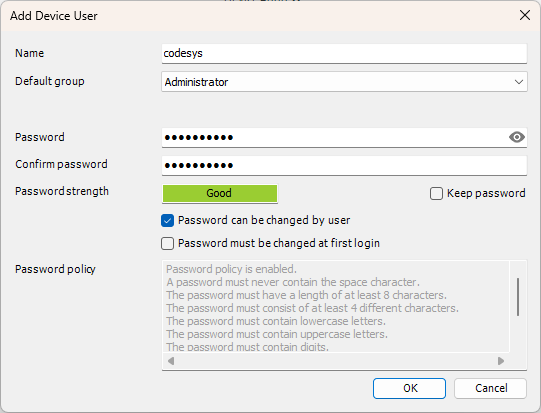

5. Double-click `PLC_PRG` to open the code editor (the program name is already set).

### 9.2 Write the program (blink + counter)

Double-click `PLC_PRG` and replace the default code with:

```pascal
PROGRAM PLC_PRG
VAR
  tickCounter  : WORD;
  blinkLed     : BOOL;
  counterValue : WORD;
END_VAR

IF tickCounter >= 50 THEN
  tickCounter := 0;
  blinkLed := NOT blinkLed;
  counterValue := counterValue + 1;
END_IF;
tickCounter := tickCounter + 1;
```

> Compile passed (`0 errors, 0 warnings`):

> 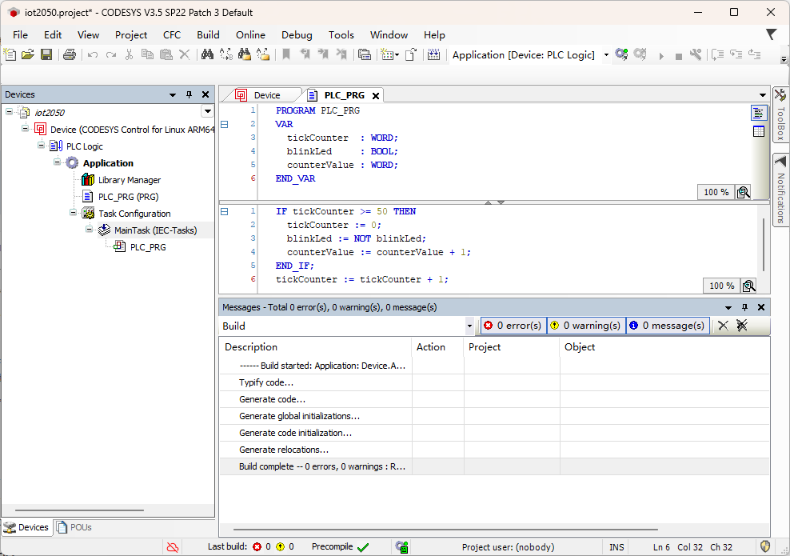

> **Important assumption**: the logic assumes a 10 ms MainTask cycle. If your task cycle differs, scale the `tickCounter >= 50` threshold accordingly (20 ms cycle → 25; 50 ms cycle → 10).
>
> How to change it: double-click **Task Configuration → MainTask** → **Interval** → `T#10ms`.
>
> **Clear the POU editor before pasting** (Ctrl+A → Delete) to avoid stale code confusing the parser.
>
> Logic: `tickCounter` counts task cycles; every 500 ms `blinkLed` toggles (1 Hz blink) and `counterValue` increments.

> 💡 **Why not use the TON / CTU function blocks?** On a fresh CODESYS project, if the Standard library is not loaded properly, function-block calls fail with errors like `',' AT or ':' expected instead of '('`. This pure `IF` + WORD arithmetic version **depends on no function blocks at all** and compiles on any version — verify the soft PLC runs first, then switch back to function blocks later if you like.

### 9.3 Download and run

1. Menu **Online → Login** (or the login toolbar icon); in the communication settings enter the IoT2050 IP `<IoT2050-IP>`.
2. Menu **Online → Download**, confirm.

   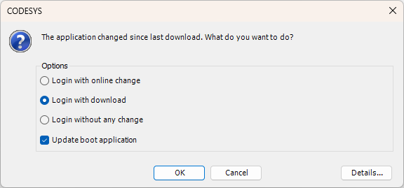

3. Menu **Debug → Start** (F5) to start.

### 9.4 Watch and verify

1. Double-click `PLC_PRG` to enter online monitoring:

   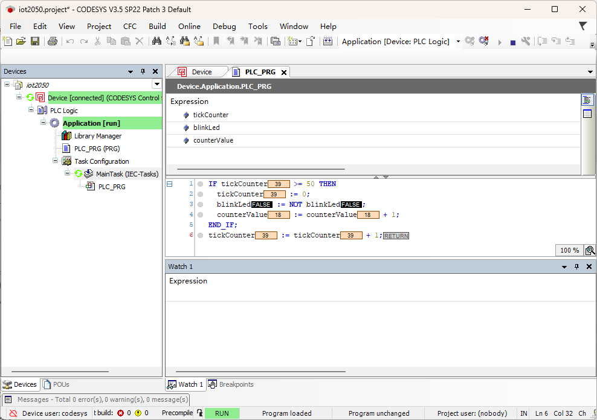

2. Watch the variables:
   - `blinkLed`: toggles between `TRUE` / `FALSE` every 500 ms (1 Hz blink)
   - `counterValue`: increments by 1 every 500 ms (+2 per second)

When both variables change as expected, the soft PLC is running correctly on the IoT2050.

---

## 10. Licensing (removing the 2-hour limit)

1. Buy the **CODESYS Control for Linux ARM SL single-device license** (Application-Based License) from the CODESYS Store.
2. In the IDE, log in with your CODESYS account in License Manager → activate it to the target device.

> Without a license the runtime stops every 2 hours and must be restarted manually to get another 2 hours — fine for development only. **Buy a license for production.**

---

## 11. Common pitfalls at a glance

| Symptom | Cause / Fix |
|---|---|
| No `Deploy Control SL` under `Tools` | **CODESYS Control SL Deploy Tool** not installed → add it with the Installer |
| Runtime fails to start | On the manual `dpkg -i` path, run `apt --fix-broken install` first to resolve dependencies; the Deploy path never hits this |
| Missing dependencies | Custom image was stripped → `apt update && apt --fix-broken install` |
| IDE cannot connect | Communication port is in `/etc/CODESYSControl.cfg`, `[CmpChannel]` section (TCP 11740 by default) |
| Firewall blocks it | Allow the communication port; on industrial sites expose it on the LAN only |
| Conflicts with existing services | Node-RED (1880), MQTT (1883) etc. don't clash with this port; measure CPU usage in practice |
| Wrong architecture package | Must be **ARM64 SL** — not the x86 or Raspberry Pi packages |
| Is my image really RT? | The file name proves nothing — **only `uname -r` containing `rt` counts** |

---

## 12. Summary

The whole chain has three parts: **① build an RT-kernel image with GitHub Actions → ② push the runtime onto the IoT2050 with Deploy Control SL → ③ write an ST program, download it and verify.**

The two things that trip people up most:

1. **The RT kernel**: a soft PLC's real-time behavior is provided by the kernel, not by CODESYS itself. A stock image installs and runs but gives no timing guarantees — build the RT image first and install onto that, done in one go.
2. **Deploy Control SL is a separate component**: installing only the IDE gives no `Tools → Deploy Control SL` menu — you must add the Deploy Tool with the Installer.

The full flow (image build → runtime deploy → program execution) has been verified end to end. Questions and feedback are welcome.

---

## References

- CODESYS Store (ARM64 SL download): https://store.codesys.com/en/codesys-control-for-linux-arm-sl-1.html
- CODESYS official installation docs: https://content.helpme-codesys.com/en/CODESYS%20Control/_rtsl_install_runtime_on_controller.html
- CODESYS Control for Linux ARM SL release notes: https://www.codesys.com/ecosystem/release-lifecycle/releases-updates/control-for-linux-arm-sl/
- meta-iot2050 repository (V01.06.04 tag): https://github.com/siemens/meta-iot2050
- Reference practice (IoT2050 → SoftPLC): https://www.linkedin.com/pulse/siemens-iot2050-open-gateway-can-also-run-codesys-davide-nardella-71pjf

---

> ⚠️ **Disclaimer**: This article is a personal technical write-up reflecting the author's own experience and opinions, unrelated to any commercial organization. The operations described involve flashing embedded system images and deploying commercial software — proceed with caution. For production or industrial use, have qualified personnel perform and fully test the changes. CODESYS is commercial software; buy an official license and comply with its terms before commercial use. The author accepts no liability for any direct or indirect loss resulting from the use of this content.
