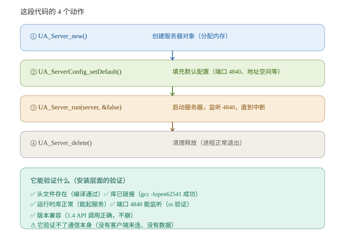

# Customizing the Official IoT2050 Image with Minimal Changes: Integrating open62541 (OPC UA) via a kas Fragment

> Applies to: developers who have forked `siemens/meta-iot2050` and built the example image on GitHub Actions.
> Base version: V01.06.04 (Debian 13 trixie).
> Pain point: you don't want to touch the underlying Isar/BitBake recipes — you just want to add a few packages to the official example image.

## Table of Contents

- [What you'll get from this article](#what-youll-get-from-this-article)
- [1. Good news: open62541 is in Debian 13 packages — no source compilation needed](#1-good-news-open62541-is-in-debian-13-packages)
- [2. Prerequisites](#2-prerequisites)
- [3. Step 0: Create a dev branch from V01.06.04](#3-step-0-create-a-dev-branch-from-v010604)
- [4. Implementation: minimal kas fragment changes](#4-implementation-minimal-kas-fragment-changes)
- [5. Flash and verify open62541](#5-flash-and-verify-open62541)
- [6. Want more tools? Just add lines to the list](#6-want-more-tools-just-add-lines-to-the-list)
- [7. FAQ / Notes](#7-faq--notes)
- [References](#references)

---

## What you'll get from this article

A **minimal-change** customization path: without touching any underlying recipes, add just **1 kas fragment file** + modify **1 build command line**, and the IoT2050 image will include the open-source OPC UA library open62541 — while leaving room to keep adding tools later (Modbus / MQTT / SQLite…).

All you need is GitHub web operations to add files on a branch; the build runs automatically in cloud CI.

---

## 1. Good news: open62541 is in Debian 13 packages — no source compilation needed

Before starting, two key facts were verified that **directly affect what you do**:

| Question | Answer |
| --- | --- |
| Which Debian is V01.06.04 based on? | **Debian 13 trixie** |
| Is open62541 in trixie? | ✅ **Yes! open62541 1.4.11.1-1** (stable), arm64 available |
| Which packages? | `libopen62541-1.4` (runtime), `-dev` (headers + link library). ⚠️ trixie no longer ships a `-tools` package |
| Do you need to compile the source yourself? | **No** — install directly from the official repos with apt |
| How do packages get into the image? | Injected via `IMAGE_PREINSTALL:append` (details below) |

**Core idea**: image customization = appending a few package names to the build config — almost as simple as "apt install".

---

## 2. Prerequisites

- A fork of `siemens/meta-iot2050` (including the V01.06.04 tag)
- Some GitHub Actions experience (triggering the `Build Debian example image` workflow)
- Local Git installed (only needed for creating the branch, see below)

---

## 3. Step 0: Create a dev branch from V01.06.04

> ⚠️ **You must create the branch with local Git**: the GitHub web UI does not allow creating a branch from a tag — tags are read-only snapshots; you can't add files to them or use them as a branch source. Pure web operations will dead-end.

```bash
# If the fork is already cloned, cd into it and skip the first two lines
git clone https://github.com/<your-username>/meta-iot2050.git
cd meta-iot2050
git fetch origin
git switch -c custom-v01.06.04 V01.06.04   # create branch from the tag (git 2.23+; equivalent to checkout -b)
git push origin custom-v01.06.04
```

From now on, all changes happen on the `custom-v01.06.04` branch to avoid polluting main.

---

## 4. Implementation: minimal kas fragment changes

### 4.1 Create `kas/my-custom.yml`

Create a new file in your fork's branch with this content:

```yaml
header:
  version: 14

local_conf_header:
  custom-packages: |
    # open62541 (OPC UA) - ready-made package from the Debian trixie repos, use IMAGE_PREINSTALL (no recipe needed)
    IMAGE_PREINSTALL:append = " libopen62541-1.4 libopen62541-1.4-dev"
```

> ⚠️ **The first line of the file must be `header:`** — do not put a `#` comment at the top: kas's YAML parser doesn't allow config files to start with a comment, otherwise you get `Configuration file is not valid YAML: Error in line 1`. `#` comments *inside* `local_conf_header` are fine.

**Two key points**:
- **Why `IMAGE_PREINSTALL`**: in Isar, `IMAGE_INSTALL` only installs packages built by recipes in your layer — without a recipe you get `Nothing PROVIDES`; open62541 is a ready-made Debian package, so it must go through `IMAGE_PREINSTALL`.
- `IMAGE_PREINSTALL:append` **must include a leading space** (`" libopen..."`), otherwise it gets concatenated with the previous value.
- Install 2 packages: `-1.4` runtime library; `-dev` headers + link library (needed only for on-device compilation). ⚠️ Don't write `-tools` — trixie's open62541 1.4 has removed that package; writing it gives `Nothing PROVIDES`.

### 4.2 Modify `.github/workflows/main.yml` (1 line)

Find the Build step in the `debian-example-image:` job:

```yaml
      - name: Build image
        run: ./kas-container build kas-iot2050-example.yml:kas/opt/package-lock.yml
```

Change it to (chain in `kas/my-custom.yml`, **after** the example main config):

```yaml
      - name: Build image
        run: ./kas-container build kas-iot2050-example.yml:kas/my-custom.yml:kas/opt/package-lock.yml
```

If you also use the QEMU job (`debian-example-qemu-image`), append to its Build line the same way:

```yaml
      - name: Build image
        run: ./kas-container build kas-iot2050-example.yml:kas/my-custom.yml:kas-iot2050-qemu.yml:kas/opt/package-lock.yml
```

### 4.3 Trigger the build

Actions → Run workflow (Branch: `custom-v01.06.04`) → wait 1–2 hours → download the `iot2050-example-image` artifact (Image.wic).

---

## 5. Flash and verify open62541

1. Flash Image.wic to an SD card (`bmaptool` or `dd`, per the official README).
2. After the IoT2050 boots, verify:

```bash
# 1) Confirm the packages are installed (ii status = installed)
dpkg -l | grep open62541
# should show two ii lines: libopen62541-1.4 / -dev

# 2) Confirm the library files and headers (open62541 is a library, not an executable —
#    there is no `open62541` command to type, that's normal)
dpkg -L libopen62541-1.4 | grep '\.so$'      # should show /usr/lib/aarch64-linux-gnu/libopen62541.so.*
ls /usr/include/open62541/                   # should show client.h, server.h, types.h, etc.

# 3) Optional: check the version with pkg-config (not installed by default on slim images — install it first)
apt install -y pkg-config
pkg-config --modversion open62541            # should print 1.4.11.1

# 4) Compile and run a minimal OPC UA Server
cat > /tmp/ua_server_test.c <<'EOF'
#include <open62541/server.h>
#include <open62541/server_config_default.h>
int main(void) {
    UA_Server *server = UA_Server_new();
    UA_ServerConfig_setDefault(UA_Server_getConfig(server));
    UA_Server_run(server, &(UA_Boolean){false});
    UA_Server_delete(server);
    return 0;
}
EOF
gcc -o /tmp/ua_server_test /tmp/ua_server_test.c -lopen62541 && echo "Compile OK"
/tmp/ua_server_test &                 # listens on port 4840 by default
sleep 2
ss -tlnp | grep 4840                  # should show LISTEN 4840

# 5) Optionally verify with Python asyncua:
#    pip install asyncua, then connect to opc.tcp://127.0.0.1:4840
```

#### 5.1 What does this minimal server do? (line-by-line)

That 6-line minimal server in step 4 is really 4 actions:

```c
UA_Server *server = UA_Server_new();                     // ① create the server object (allocate memory)
UA_ServerConfig_setDefault(UA_Server_getConfig(server)); // ② load default config (listen on 4840)
UA_Server_run(server, &(UA_Boolean){false});             // ③ start the server, blocking
UA_Server_delete(server);                                // ④ clean up and exit
```



**What it verifies (installation level)**:
- ✅ Headers exist (`#include <open62541/server.h>` compiles) → `-dev` package installed correctly
- ✅ Library links (`gcc ... -lopen62541` succeeds) → runtime library installed correctly
- ✅ Library runs (`UA_Server_run` starts the full OPC UA protocol stack; `ss -tlnp | grep 4840` shows LISTEN) → correct version, no ABI issues
- ⚠️ It does **not** verify communication itself — it just "opens a server and waits"; there's no client connection, no business data. Real IoT2050 ↔ PLC verification is covered in the separate advanced article (see the note at the end of §5).

> 💡 **"I can't see open62541" is usually a misunderstanding**: open62541 is a **library** (libopen62541), not an executable program like `mosquitto` — so `which open62541` / typing `open62541` finds nothing, and that's normal. The signs of a successful install are steps 1 and 2 above: `dpkg -l` shows `ii` and the header directory exists.
> Also, `pkg-config` is not installed by default on slim images; running it directly gives `command not found` — install it first with `apt install -y pkg-config`.

> 🔗 **Advanced verification (real OPC UA communication between IoT2050 and an S7-1200) is covered in a separate article** — see "IoT2050 ↔ S7-1200 OPC UA Communication": includes TIA server interface modeling, open62541 client code, common pitfalls, and open62541 coding pitfalls.

---

## 6. Want more tools? Just add lines to the list

| Tool | Package in trixie? | How to add |
| --- | --- | --- |
| Modbus | ✅ `libmodbus-dev` | Add a line to `IMAGE_PREINSTALL:append` in `kas/my-custom.yml` |
| MQTT | ✅ `mosquitto mosquitto-clients libmosquitto-dev` | Same |
| SQLite | ✅ `sqlite3 libsqlite3-dev` | Same |
| Software without a Debian package | ❌ | You need a self-written compile recipe (beyond this article's scope) |

---

## 7. FAQ / Notes

| Question | Answer |
| --- | --- |
| Isar uses snapshot sources — can it install open62541? | snapshot.debian.org pins packages by date; your build date is necessarily later than when open62541 entered trixie, so no issue |
| Difference between `:append` and `+=`? | `:append` concatenates strings directly (mind the leading space); `+=` deduplicates. In a fragment, `:append` is the safest choice |
| Will installing `-dev` make the image much bigger? | The whole open62541 family is ~5 MB — negligible |
| Want the SWUpdate dual-image (A/B update)? | Change the build command to `kas-iot2050-swupdate.yml:kas/my-custom.yml:kas/opt/secure-boot.yml:kas/opt/preempt-rt.yml` |
| Changed the workflow but Actions won't run? | Make sure Branch is `custom-v01.06.04` (the workflow exists on that branch and isn't disabled in the fork) |
| Where do I look if the build fails? | Actions run page → expand the Build image log → search for `open62541` or `E: Unable to locate package` (the latter = wrong package name or the package isn't in the snapshot) |

---

## References

- Official repository: https://github.com/siemens/meta-iot2050 (V01.06.04)
- Example image recipe: `meta-example/recipes-core/images/iot2050-image-example.bb`
- node-red component injection example: `meta-node-red/recipes-core/images/meta-node-red-packages.inc`
- Debian trixie open62541 package page: https://packages.debian.org/trixie/libopen62541-1.4-dev
- open62541 website: https://open62541.org

---

> ⚠️ **Disclaimer**: This article is a personal technical write-up reflecting the author's own experience and opinions, unrelated to any commercial organization. The operations described involve building and flashing embedded system images — proceed with caution. For production or industrial use, have qualified personnel perform and fully test the changes. The author accepts no liability for any direct or indirect loss resulting from the use of this content.
